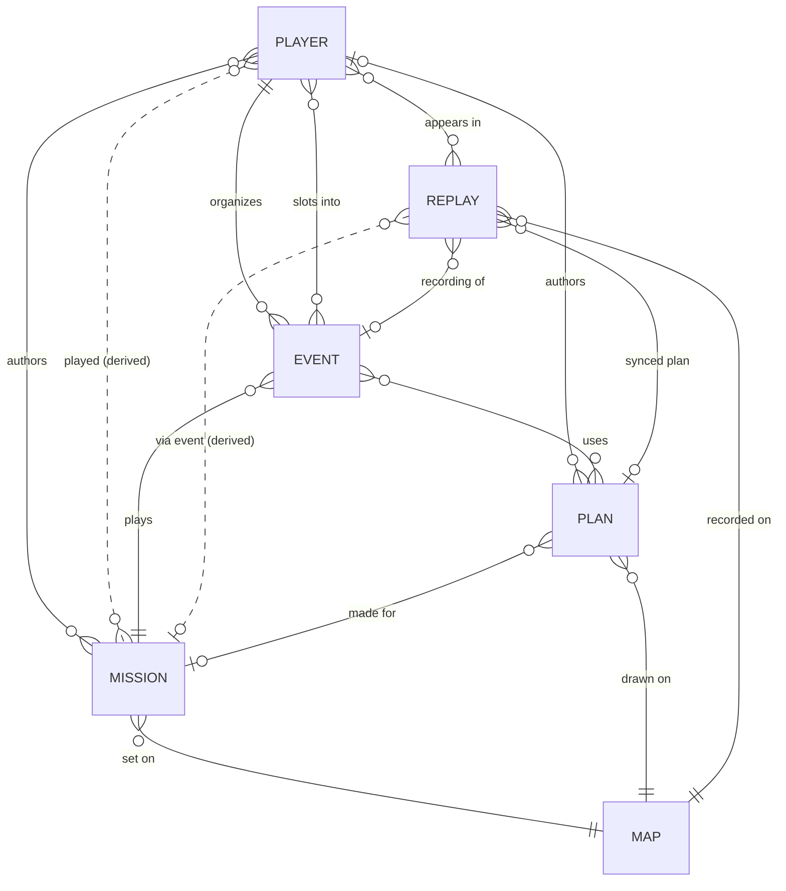

# Data model

Five core objects plus **Map** (terrain), which Mission, Plan and Replay all hang off.
Dashed (`..`) links are derived — don't store them, compute them.

## Fields (from the FigJam board)

**Event** — date & time · mission · status (upcoming / past)
- upcoming: players slotted / max slots · plan(s) submitted (by the Platoon Leader)
- past: players joined · replay(s) (several if the server restarted) · plan used · stats

**Mission** — Workshop URL · cover image · briefing · author(s) (multiple?) · tags ·
events it was part of · times played · `Markers.layer` (needed for planning)

## Facts that shaped the cardinalities

- A server restart splits one op into several replay codes → Event 0..* Replays.
- The recorder starts at server boot, so test / empty sessions produce replays with no event → Replay 0..1 Event.
- The mod stamps `planCode` into replay meta on `/syncplan`, last-wins → Replay 0..1 Plan today.
- Planner pushes now carry `mapKey`, and `mission` when opened from the hub; authors come from the hub plan (the planner has no login) → Plan 0..1 author, 0..1 mission.
- Every plan save mints a new code. Pushes made from a hub plan carry its key, so the planner groups them (`plans.lineage`) and the hub shows the newest; pushes made outside the hub stay ungrouped.
- Ops also run on Thursdays and Saturdays, not just the usual Tue 20:00 / Sun 19:00 → calendar must show extra ops.
- The slotting bot supports one active session per guild; a calendar with several open events implies multi-session slotting.

## Open decisions

1. Mission authors: co-authors and external Workshop authors → M:N (drawn that way above).
2. Can one event night run two missions? (It happened: 22 Sep 2026, Troubled Waters + Marching Fire.) If yes, Event → Mission becomes 1..*. For now each mission is its own event, so that evening is two games.
3. Keep every `/syncplan` in a session, or last-wins? Every sync → Replay ↔ Plan becomes M:N.
4. Identity: Discord account ↔ Reforger `playerGuid` mapping; `player_join` is sometimes dropped.
